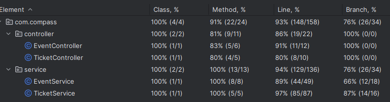

# 📌 Desafio 3 | Henrique Jornada - Gerenciamento de Eventos

Projeto com dois microserviços: ms-event-manager e ms-ticket-manager para gerenciamento de eventos e tickets usando Spring Boot, FeignClient para comunicação entre serviços e MongoDB Atlas como base de dados.
Projeto compátivel e hospedado na AWS.
Este projeto implementa dois microserviços em Spring Boot:

- **ms=event-manager**: serviço responsável por fazer o gerenciamento de eventos: cria, atualiza, lista e apaga eventos.
- **ms-ticket-manager**: serviço responsável por fazer o gerenciamento de eventos: cria, atualiza, lista e apaga tickets.

Os serviços se comunicam via FeignClient, de modo que atenda as especificacoes solicitadas. A API é documentada com Swagger.

ms-event-manager: http://localhost:8081/swagger-ui/index.html

ms-ticket-manager: http://localhost:8080/swagger-ui/index.html

# 👤 Autor

- Henrique Jornada Martinuzzi | [@jornadev](https://github.com/jornadev)

# 🚀 Tecnologias Utilizadas
- Java 17
- Spring Boot
- Feign Client
- Swagger
- MongoDB (Atlas)
- Maven
- Git/Github
- AWS (EC2)

# 📌 Endpoints Disponíveis

🟢 **ms-event-manager (Porta 8081)**

- **GET /events** → listar todos as eventos
  - **Exemplo de Request**:
    ```http
    GET http://localhost:8081/events
    ```
    **Exemplo de Resposta (JSON)**:
    ```json
    {
      "eventId": "string",
      "eventName": "string",
      "eventDateTime": "Date",
      "logradouro": "string",
      "bairro": "string",
      "cidade": "string",
      "uf": "string"
    }
    ```

- **GET /events/get-event/{id}** → lista um evento específico
  - **Exemplo de Request**:
    ```http
    GET http://localhost:8081/events/get-event/{id}
    ```
  - **Exemplo de Resposta (JSON)**:
    ```json
    {
      "eventId": "string",
      "eventName": "string",
      "eventDateTime": "Date",
      "logradouro": "string",
      "bairro": "string",
      "cidade": "string",
      "uf": "string"
    }
    ```

- **GET /events/get-event/{id}** → lista em ordem alfabética
  - **Exemplo de Request**:
    ```http
    GET http://localhost:8081/events/get-all-events/sorted/
    ```
  - **Exemplo de Resposta (JSON)**:
    ```json
    {
      "eventId": "string",
      "eventName": "string",
      "eventDateTime": "Date",
      "logradouro": "string",
      "bairro": "string",
      "cidade": "string",
      "uf": "string"
    }
    {
      "eventId": "string",
      "eventName": "string",
      "eventDateTime": "Date",
      "logradouro": "string",
      "bairro": "string",
      "cidade": "string",
      "uf": "string"
    }

- **POST /events/create-event** → cria um novo evento
  - **Exemplo de Request**:
    ```http
    POST http://localhost:8081/events/create-event
    Content-Type: application/json
    ```
  - **Exemplo de Body (JSON)**:
    ```json
    {
      "eventName": "Evento na baia da Ana",
      "dateTime": "2025-05-01T18:00:00",
      "cep": "97714261"
    }
    ```
    **Exemplo de Resposta (JSON)**:
    ```json
    {
      "eventId": "string",
      "eventName": "string",
      "eventDateTime": "Date",
      "logradouro": "string",
      "bairro": "string",
      "cidade": "string",
      "uf": "string"
    }

- **PUT /events/update-event/{id}** → atualiza um evento
  - **Exemplo de Request**:
    ```http
    PUT http://localhost:8081/events/update-event/{id}
    Content-Type: application/json
    ```
  - **Exemplo de Body (JSON)**:
    ```json
    {
     "eventName": "Novo Evento na Baia do Henrique",
     "dateTime": "2025-04-25T14:30:00",
     "cep": "97714261"
    }
    ```

- **DELETE /events/delete-event/{id}** → remove um evento
  - **Exemplo de Request**:
    ```http
    DELETE http://localhost:8081/events/delete-event{id}
    ```

🟢 **ms-ticket-manager (Porta 8080)**

- **POST /api/tickets/create-ticket/** → cria um novo ticket.
  - **Exemplo de Request**:
    ```http
    POST http://localhost:8080/api/tickets/create-ticket
    Content-Type: application/json
    ```
  - **Exemplo de Body (JSON)**:
    ```json
    {
     "customerName": "string",
     "cpf": "string",
     "customerMail": "string",
     "eventId": "string",
     "eventName": "string",
     "brlAmount": 200.00,
     "usdAmount": 40.00
    }
    ```
    **Exemplo de Resposta (JSON)**:
    ```json
    {
      "ticketId": "string",
      "cpf": "string",
      "customerName": "string",
      "customerMail": "string",
      "event": 
      {
          "eventId": "string",
          "eventName": "string",
          "eventDateTime": "Date",
          "logradouro": "string",
          "bairro": "string",
          "cidade": "string",
          "uf": "string"
      },
      "status": "Criado com sucesso",
      "usdtotalAmount": "40.0",
      "brltotalAmount": "200.0"
    }

- **GET /api/tickets/get-ticket/{id}}** → busca por ID
  - **Exemplo de Request**:
    ```http
    GET http://localhost:8080/api/tickets/get-ticket/{id}
    Content-Type: application/json
    ```
  - **Exemplo de Resposta (JSON)**:
    ```json
    {
      "ticketId": "string",
      "cpf": "string",
      "customerName": "string",
      "customerMail": "string",
      "event": 
      {
          "eventId": "string",
          "eventName": "string",
          "eventDateTime": "Date",
          "logradouro": "string",
          "bairro": "string",
          "cidade": "string",
          "uf": "string"
      },
      "status": "Criado com sucesso",
      "usdtotalAmount": "40.0",
      "brltotalAmount": "200.0"
    }

 - **GET /api/tickets/check-tickets-by-event/{eventId}}** → bsuca os tickets relacionados a um evento
  - **Exemplo de Request**:
    ```http
    GET http://localhost:8080/api/tickets/get-ticket-by-event/{eventId}
    Content-Type: application/json
    ```
  
- **GET /api/tickets/get-ticket/{id}}** → busca por ID
  - **Exemplo de Request**:
    ```http
    GET http://localhost:8080/api/tickets/get-ticket/{id}
    Content-Type: application/json
    ```
  - **Exemplo de Resposta (JSON)**:
    ```json
    {
      "ticketId": "string",
      "cpf": "string",
      "customerName": "string",
      "customerMail": "string",
      "event": 
      {
          "eventId": "string",
          "eventName": "string",
          "eventDateTime": "Date",
          "logradouro": "string",
          "bairro": "string",
          "cidade": "string",
          "uf": "string"
      },
      "status": "Criado com sucesso",
      "usdtotalAmount": "40.0",
      "brltotalAmount": "200.0"
    }

 - **PUT /api/tickets/update-ticket/{id}** → atualiza um ticket
  - **Exemplo de Request**:
    ```http
    PUT http://localhost:8080/api/tickets/update-ticket/{id}
    Content-Type: application/json
    ```
  - **Exemplo de Body (JSON)**:
    ```json
    {
      "customerName": "string",
      "cpf": "string",
      "customerMail": "string",
      "eventId": "string",
      "eventName": "string",
      "brlAmount": 200.00,
      "usdAmount": 40.00
    }
    ```

- **DELETE /api/tickets/cancel-ticket/{id}** → remove um ticket
  - **Exemplo de Request**:
    ```http
    DELETE http://localhost:8080/api/tickets/cancel-ticket/{id}
    ```

Também é possível visualizar os endpoints na interface gráfica fornecida pelo Swagger, acessando os links disponibilizados no inicio deste arquivo.: 

## ⬇️ Arquivo JSON com Endpoints para Importação no Postman

Para facilitar o teste dos endpoints, disponibilizamos um arquivo JSON formatado para importação direta no Postman. Este arquivo contém todas as configurações de requisição necessárias para interagir com os microserviços.

[**Download do arquivo JSON:** REST API basics- CRUD.event-ticket.json](https://github.com/jornadev/Desafio3-HenriqueJornada/blob/developer/assets/REST%20API%20basics-%20event-ticket.json)


**Como importar no Postman:**

1.  Baixe o arquivo `REST API basics- event.ticekt.json` clicando no link acima.
2.  Abra o Postman.
3.  Clique no botão "Import" (geralmente no canto superior esquerdo).
4.  Escolha a opção "Import from File" e selecione o arquivo JSON que você baixou.

Após a importação, você terá uma nova Collection no Postman com todos os endpoints pré-configurados, prontos para serem utilizados.

# 💻 Rodando localmente

Obs: Caso apareça um erro indicando que a variável nao está no construtor default, resolva da seguinte forma:

Settings > Build, Execution, Deployment > Compiler > Anotation Processors > na aba intermediária em (Anotation profile) marque a opcao "Obtain processors from project classpath".


Clone o projeto

```bash
  git clone https://github.com/jornadev/Desafio3-HenriqueJornada.git
```

Entre no diretório do projeto e abra na IDE de sua preferência (recomendado o Intellij)

```bash
  cd Desafio3_HenriqueJornada
```

Instale (ou atualize) as dependências caso necessário

Rode o ms-event-manager

```bash
    mvn spring-boot:run
```

Rode o ms-ticket-manager 

```bash
    mvn spring-boot:run
```

Agora os microserviços estão rodando em:

- ms-ticket-manager: http://localhost:8080
- ms-event-manager: http://localhost:8081

Usando o Postman ou algum software para fazer as requisições.

Feito isso, você estará pronto para requirir as demais funcionalidades da aplicação.

# 📌 Testes

O projeto conta com uma considerável cobertura de testes, para garantir seu pleno funcionamento.


-

# ❌ Exceções

Possíveis erros foram tratados com o objetivo de aumentar a eficácia do serviço e orientar o cliente em caso de 
falhas, conforme solicitado na documentação do projeto. Caso um evento tenha tickets vendidos, o sistema não permite que 
ele seja apagado. Além disso, realizamos uma verificação no momento da criação de um ticket para garantir que o 
evento realmente existe. Essas são as duas exceções principais, porém, várias outras exceções adjacentes também foram implementadas.


